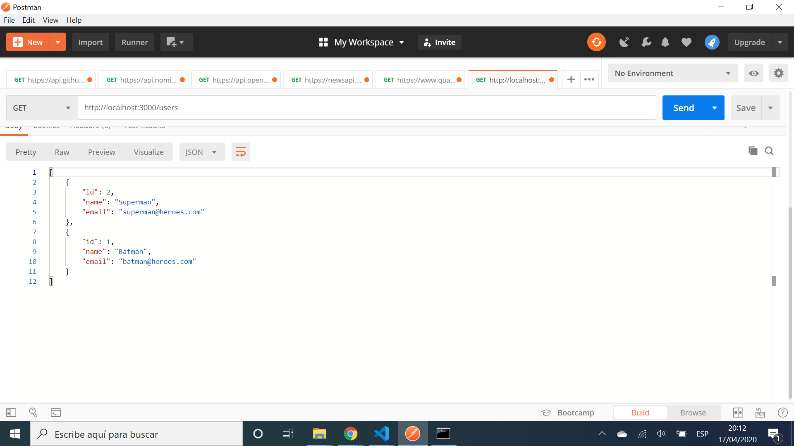

# :zap: PostgreSQL Rest API

* App using nodejs with express middleware to connect to a PostgreSQL database and make Create, Read, Update & Delete (CRUD) operations of user data

## :books: General info

* PostgreSQL needs to be installed and running - I started it from my Windows 10 PostgreSQL 12 dropdown option 'SQL shell (psql)'
* PostgreSQL shell commands: `\l` list all databases. `\c database1` connect to database1. `\dt` inspect tables. `\d users` see detail of table with name users. `\q` to quit.
* Src (source) folder contains raw code in typescript. Dist (distribution) folder will contain minified/concatenated javascript code for production

## :camera: Screenshots



## :signal_strength: Technologies

* [tsc --watch command](https://www.typescriptlang.org/docs/handbook/compiler-options.html) used to run local compiler in watch mode
* [PostgreSQL v12](https://www.postgresql.org/) database
* [PostgreSQL Installer for Windows](https://www.postgresqltutorial.com/install-postgresql/)
* [Express.js middleware v4](https://expressjs.com/)
* [Postman](https://www.postman.com/) to perform CRUD operations on backend database

## :floppy_disk: Setup

* Create PostgreSQL database and add access credentials to your own `src/routes/config.ts` file (not in repo)
* Add a `/dist` folder at same level as `/src` folder
* Run `npm install` to install dependencies
* Run `npm run dev` to compile app and connect to server `localhost: 3000`
* Run `npm run build` to compile app

## :computer: Code Examples

* code to fetch a user from the Postgres database using id

```typescript
export const getUserById = async (
  req: Request,
  res: Response
): Promise<Response> => {
  const id = parseInt(req.params.id);
  const response: QueryResult = await pool.query(
    "SELECT * FROM users WHERE id = $1",
    [id]
  );
  return res.json(response.rows);
};
```

## :cool: Features

* PostgreSQL access credentials hidden from GitHub in `config` file
* Postman used to perform CRUD operations on PostgreSQL database

## :clipboard: Status & To-do list

* Status: Fully working basic CRUD app
* To-do: nothing

## :clap: Inspiration

* [Fazt Code: Youtube tutorial in Spanish: Nodejs, PostgreSQL & Typescript, REST API CRUD](https://www.youtube.com/watch?v=z4BNZfZ1Wq8)

## :envelope: Contact

* Repo created by [ABateman](https://www.andrewbateman.org) - you are welcome to [send me a message](https://andrewbateman.org/contact)
